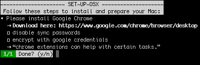

#SET-UP-OSX

*Set-up-osx* provides a way to follow an install flow when you do a clean-install or you want people to follow certain steps when installing software.

## Features

* install apps and/or execute scripts in a predefined consecutive order
* determine if an app or script is already executed and then skip that step

## Getting started

You need to follow 2 steps initially to run your process:

* Install [Node.js](https://nodejs.org) or use [NVM](https://github.com/creationix/nvm) 
* Install this library with ```npm install set-up-osx```

Then you can run any install flow you like by doing this:

```javascript
node --use_strict index.js yourdatafile.json --user your_username
``` 

Probably obvious but this is only supported on Apple OSX while the code is based on [Node.js](https://nodejs.org) it should be portable to other platforms.

## API

To use this library you have 2 types of options. 

### CLI

* ```--user your_osx_username``` : like referenced on ```/Users/your_osx_username/...```
    * this CLI variable can be used to create entries in the JSON configuration that is not to a single user

### CONFIGURATION

This is described in any type of file but the content needs to be formatted as JSON.

* ```note``` : the question / note that will be visible in the step presented to the user to take
* ```check``` : the filepath to the file or directory where the app/script should be installed or set its assets
* ```execute``` : execute a terminal script
* ```subtasks``` : show extra information to execute with this task
* ```comments``` : show extra information to read with this task (~tips)
* ```url``` : download the app from this url

These values are all optional, but ```note``` and ```category``` are the basic JSON properties of a step.

An example (like ```example.json```) would then be:

```json
{
  "steps": [
    {
      "note": "Please install Google Chrome",
      "check": "/Applications/Google Chrome.app",
      "url": "https://www.google.com/chrome/browser/desktop",
      "subtasks": [
        "disable sync passwords",
        "encrypt with google credentials"
      ],
      "comments": [
        "chrome extensions can help with certain tasks."
      ]
    }
  ]
}
```

which will result in:



**TIP**: when you reference valid urls ```http(s)://....``` inside the JSON formatted configuration it is possible to double-click in Terminal to directly open in a browser.


## Roadmap
 
These are some of the subjects I want to implement. 
 
* tests
* store vars to use later after initial question(s)
* TODO: make PATH file? to run set-up-osx in your CLI?
* TODO: multi-step feedback?
* TODO: stop when failed (or an option)


# Contributing
Please do test (```npm test```), debug and create pull requests/issues/remarks to further extend/stabilize this library.


# Changelog  
0.9.0 initial release  


# Alternatives
Different alternatives exist, like [Github Boxen](https://boxen.github.com), custom bash scripts or [Cask](http://caskroom.io) (based on [Brew](http://brew.sh)), but I missed the option to merge apps and (OSX) scripts in a flow that is repeatable and easy to extend. And because I like [Node.js](https://nodejs.org) which was a nice experiment.
